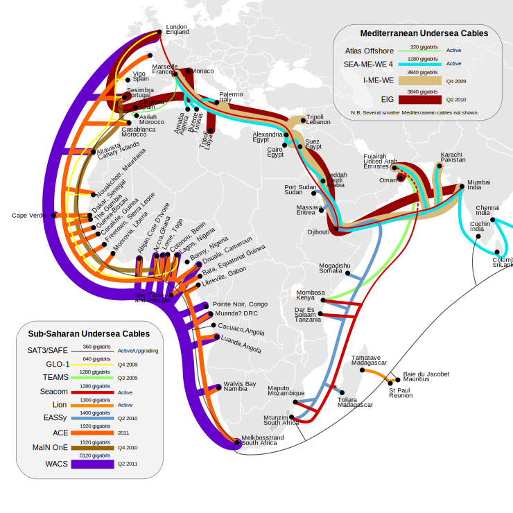

##**Party** like it's December 31st, **1983**

<a href="https://twitter.com/CryptoCH">@CryptoCH</a>

<footer>
   
</footer>

# Introduction

------------------

## **CryptoParty** ?

- @Asherwolf
- libre et gratuite d'accès
- publique
- non commercial et non alignée politiquement
- contre toutes formes de discrimination et d'harcèlement sexuel

Créé vers décembre 2012 suite aux lois sur la rétention de données en Australie.
Partage des connaissances.

------------------

## Cryptographie et sécurité

- cryptographie $\neq$ sécurité
- la sécurité est une **hygiène**
- tout à un coût
- (d'apprentissage, de temps...)

On peut avoir le meilleur algorithme de chiffrement, si on laisse la clé trainer il est inutile
La sécurité total n'existe pas. La sécurité est une voie, rien ne se fait du jours au lendemain, tout est graduel, et on fait des erreurs.

------------------

## **FOSS** et logiciel privateur

- **F**ree and **O**pen **S**ource **S**oftware
- liberté de l'utilisateur
- avantage en sécurité

Car auditable, si même en connaissant l'algorithme complet qui protège ont ne peux le casser, alors il est sécurisé.

------------------

# Internet &lt;**3**

------------------

##Internet &lt;**3**

- système d'interconnexion de réseau
- **I**nternet **P**rotocole
- entre 1970 et 1980
- **dépourvu de sécurité**
- réseau basé sur la **confiance**

Dépourvu de sécurité, mais créer de façon à être suffisamment généralisable pour qu'on le sur-couche de sécurité.

------------------

Paquets passe par votre routeur, votre FAI, d'autre réseau, et arrive enfin à destination. Mode patate chaude.

------------------

#**Internet** ça laisse des **traces**

------------------

##**Internet** ça laisse des **traces**

- dans votre ordinateur
- dans votre **routeur**
- chez votre **FAI**
- chez les **sites** que vous contactez
- sur toutes les **machines intermédiaires**
- smartphone, tablettes, appareils connectés...

------------------

##Législation

- loi sur la **rétention** de donnée
- **6 mois** en Suisse
- Europe (6 mois à 2 ans)
- Allemagne, Belgique, (République Tchèque, Norvège)

Allemagne et Belgique non pas de loi sur la rétention de données. République Tchèque en cour de changement, Norvège jusqu'en 2015

------------------

#Surveillance d'**Internet**

Récapitulons: Internet est un réseau ouvert, il à été créé sans la sécurité à l'esprit, le réseau est basé sur la confiance dans ses noeuds, les acteurs majeurs sont des acteurs commerciaux.

------------------

------------------

#Protection

------------------

##Protection

> "Using **cryptography** is like having **safe sex**." -- Jacob\ Appelbaum

- anonymisation (**Tor**, **I2P**)
- darknet (**freenet**)
- web (**https**)
- e-mail (**GPG**), chat, SMS (**OTR**)
- chiffrement de ses disques
- cryptomonnaie, bitmessage, twister...

Protéger ses communications ce n'est pas seulement se protéger sois même, c'est protéger les autres.
Vous ne pouvez pas contrôler ce que vas dire votre correspondant. C'est peut être anodin aujourd'hui, mais tout cela est collecté hors contexte.

------------------

##Bullshit-**O**-meter

- "Notre algorithme révolutionnaire"
- "Nos logiciels **brevetés**"
- "Chiffrement de grade militaire"
- "Les données **s'auto-détruises**"
- Cloud

------------------

# &lt;**3**

- bug...

C'est tout ce que j'ai.

