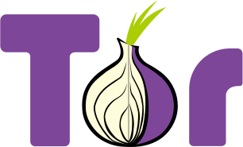
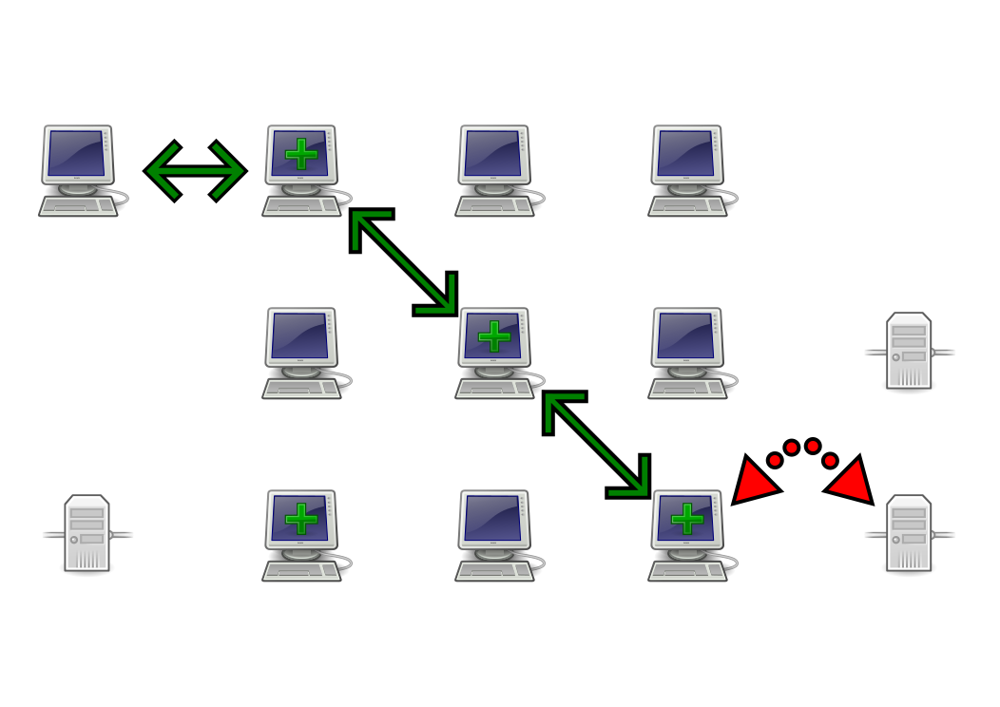

##**Anonymisation** des connexions avec **Tor**

<a href="https://twitter.com/CryptoCH">@CryptoCH</a>

<footer>
   
</footer>

# **I**nternet **P**rotocol

------------------

## **I**nternet **P**rotocol

- paquets qui **transitent** sur le réseau
- adresse **IP** (ex: 192.168.0.1)
- adresse de **destination** et **source**
- contenu
- https : protège le **contenu**.

# Tor

------------------

## Origine

- projet du U.S Naval Laboratory (1996)
- **T**he **O**nion **R**outing project
- 2004 : "Tor: The Second-Generation Onion Router"
- Fondation

Fondation dont les développeurs et salariés se font arrêter aux frontières de pays "libre" pour faire pression.

------------------

## Fonctionnement

- Tor ne **protège pas** le contenu
- masque l'adresse source et destination
- fait **rebondir** les paquets au sein du réseau

contrairement à https (pour le web), Tor ne chiffre pas le contenu, mais masque les adresses source et destination.
effet flipper, on ne sait plus d'où vient l'info.

------------------

------------------

# Go ? https://**torproject**.org

- bug
